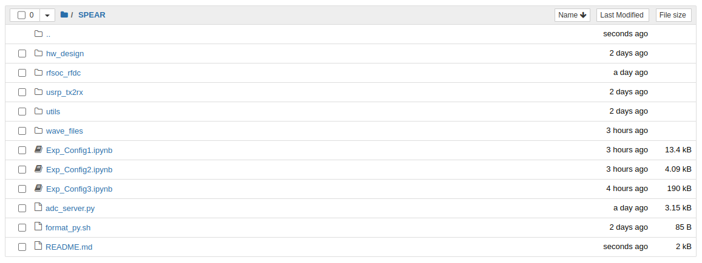
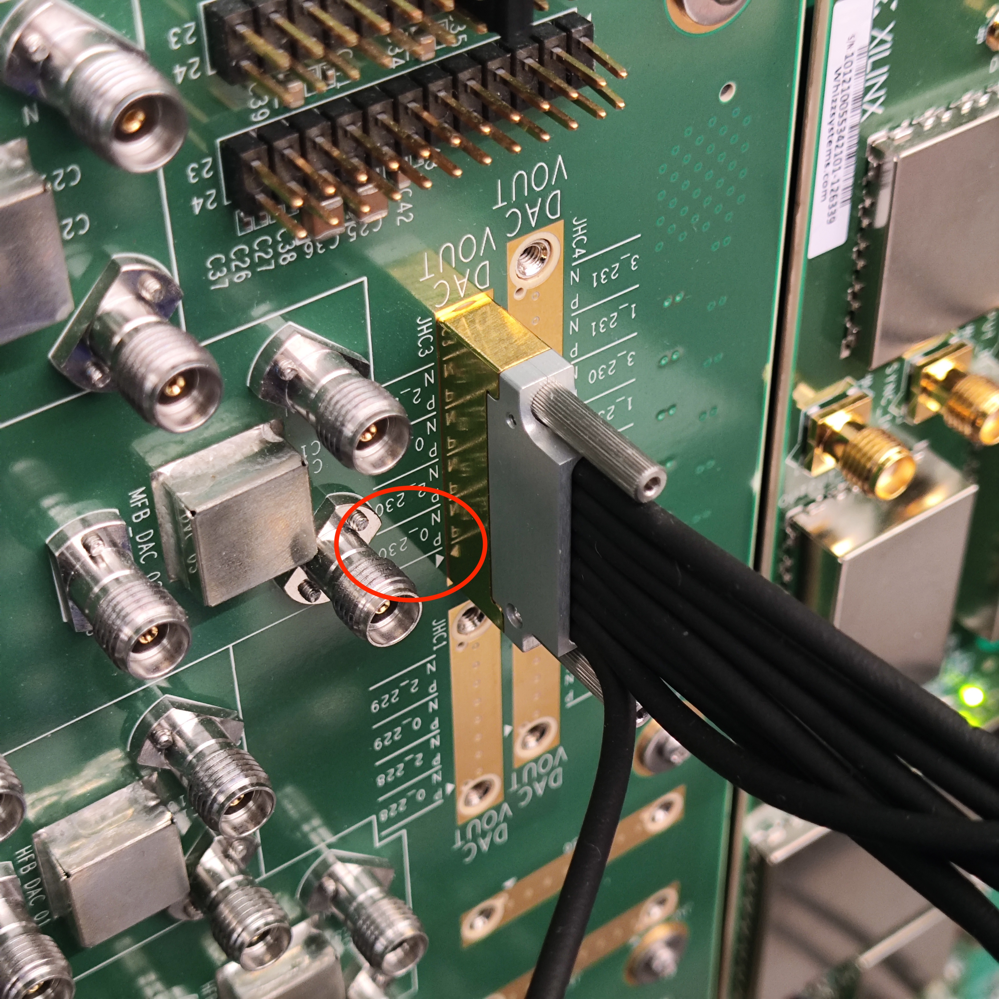
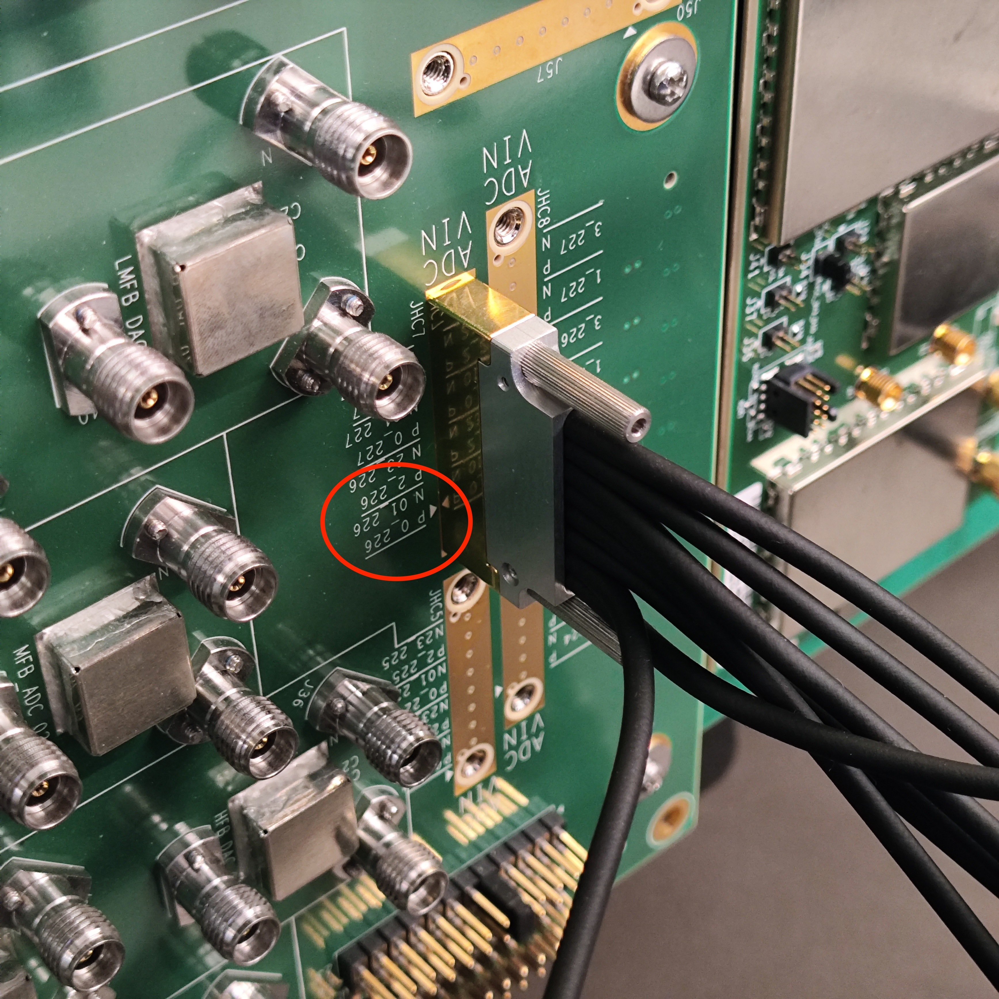
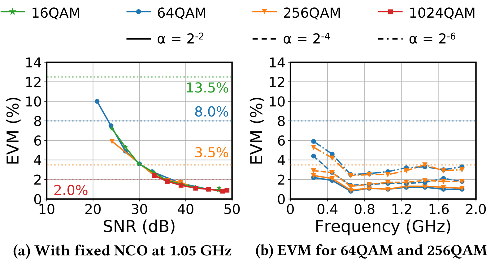
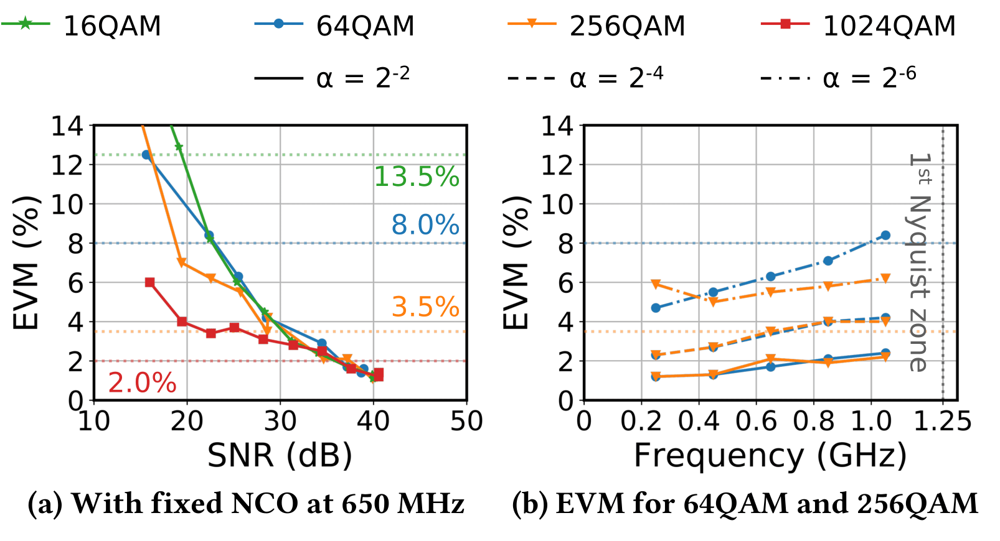
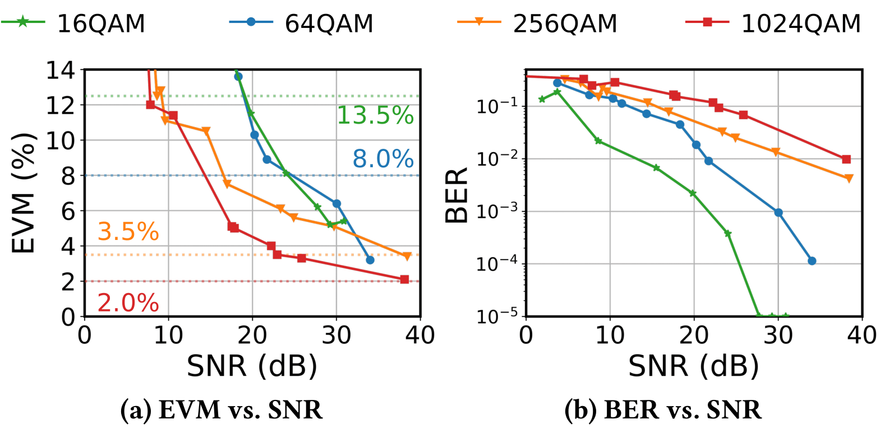

## SPEAR: Software-defined Python-Enhanced RFSoC for Wideband Radio Applications

Welcome to the SPEAR repository! This project provides complete software and hardware designs for a real-time wideband testbed built on the [Xilinx RFSoC](https://www.amd.com/en/products/adaptive-socs-and-fpgas/soc/zynq-ultrascale-plus-rfsoc.html) technology.

### System Requirements

Before getting started, ensure you have:
- Vivado 2021.1 installed on your host computer (Linux/Windows with x86 architecture)
- An SD card containing the [PYNQ image for ZCU216](https://github.com/sarafs1926/ZCU216-PYNQ)
- A [Xilinx RFSoC ZCU216 board](https://www.xilinx.com/products/boards-and-kits/zcu216.html)
- A valid Vivado license from Xilinx for generating ZCU216 board bitstreams. You shall download your license [here](https://account.amd.com/en/forms/license/license-form.html)

### Bitstream Preparation Instructions

- First, clone the repository on your host computer:
```
git clone git@github.com:functions-lab/SPEAR.git
```

- Navigate to the hardware design project:
```
cd ./SPEAR/hw_design/ZCU216
```

- Generate block designs and bitstreams for each configuration:

For Config 1:
```
make bd DESIGN=rfsoc_rfdc_v39_100M; make bit DESIGN=rfsoc_rfdc_v39_100M;
```

For Config 2:
```
make bd DESIGN=rfsoc_rfdc_v39_NB; make bit DESIGN=rfsoc_rfdc_v39_NB;
```

For Config 3:
```
make bd DESIGN=rfsoc_rfdc_v39; make bit DESIGN=rfsoc_rfdc_v39;
```

The compilation process for each design takes some time (depends on the number of cores you have). Be patient and grab yourself a cup of coffee. 

### Configuration Specifications

Each configuration offers different sampling rates and bandwidths:

|  | Config 1 | Config 2 | Config 3 |
|--------|----------|----------|----------|
| DAC Sampling Rate (MSaps) | 4000.0 | 2500.0 | 2500.0 |
| DAC Interpolation Rate | 40x | 8x | 2x |
| ADC Sampling Rate (MSaps) | 2000.0 | 2500.0 | 2500.0 |
| ADC Interpolation Rate | 20x | 8x | 2x |
| IQ bandwidth | 100 MHz | 312.5 MHz | 1250 MHz |

The generated files (`*.bit` and `*.hwh`) will be located in:
```
./SPEAR/hw_design/ZCU216/block_designs/rfsoc_rfdc_v39/rfsoc_rfdc_v39_proj/rfsoc_rfdc_v39_proj.runs/impl_1/rfsoc_rfdc_v39_wrapper.bit
```
and
```
./SPEAR/hw_design/ZCU216/block_designs/rfsoc_rfdc_v39/rfsoc_rfdc_v39_proj/rfsoc_rfdc_v39_proj.gen/sources_1/bd/rfsoc_rfdc_v39/hw_handoff/rfsoc_rfdc_v39.hwh
```
Rename the generated `rfsoc_rfdc_v39_wrapper.bit` file to `rfsoc_rfdc_v39.bit` to make sure both `*.hwh` and `*.bit` files have the same prefix.

### ZCU216 Setup and Testing

- Boot the RFSoC with the prepared SD card
- Connect both the ZCU216 board and host computer to the same network
- SSH into the ZCU216 (default credentials: username: `xilinx`, password: `xilinx`)
- Clone the repository to `/home/xilinx/jupyter_notebooks`:
```
git clone git@github.com:functions-lab/SPEAR.git
```

- Access the Jupyter Notebook interface at `your_zcu216_ip:9090/tree` (default password: `xilinx`)
- You'll find three experiment notebooks: `Exp_Config1.ipynb`, `Exp_Config2.ipynb`, and `Exp_Config3.ipynb`


- Upload the generated `*.bit` and `*.hwh` files from your host computer to `./SPEAR/rfsoc_rfdc/bitstream/` directory using the upload button in the top-right corner of the Jupyter Notebook interface

### ZCU216 Wiring Setup 

- Create a loopback connection between DAC #0 on DAC tile 230 and ADC #0 on ADC tile 226 as shown in the following figures:





- The CLK104 board on the ZCU216 board generates reference clock for DACs and ADCs. Make sure the `DAC_RFCLK_B` and `ADC_RFCLK_B` ports from CLK104 boards are connected to ZCU216 as shown in the following figures: 


### Experimental Results

Our testing shows the following performance characteristics:

- Config 1 and Config 2 SNR versus EVM performance and EVM across different carrier frequencies (NCO) in the first Nyquist zone:




- Config 3 SNR versus EVM performance:

